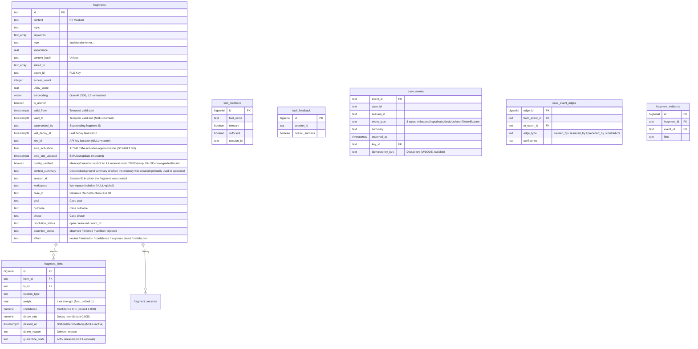

# Architecture

## System Architecture


```
server.js  (HTTP server)
    |
    +-- POST /mcp          Streamable HTTP -- JSON-RPC receiver
    +-- GET  /mcp          Streamable HTTP -- SSE stream
    +-- DELETE /mcp        Streamable HTTP -- Session termination
    +-- GET  /sse          Legacy SSE -- Session creation
    +-- POST /message      Legacy SSE -- JSON-RPC receiver
    +-- GET  /health       Health check
    +-- GET  /metrics      Prometheus metrics
    +-- GET  /authorize    OAuth 2.0 authorization endpoint
    +-- POST /token        OAuth 2.0 token endpoint
    +-- GET  /.well-known/oauth-authorization-server
    +-- GET  /.well-known/oauth-protected-resource
    |
    +-- lib/jsonrpc.js        JSON-RPC 2.0 parsing and method dispatch
    +-- lib/tool-registry.js  18 memory tool registration and routing
    |
    +-- lib/memory/
            +-- MemoryManager.js          Business logic orchestration layer (904 lines, singleton). Entry point for remember/recall/forget/amend. Actual logic delegated to Processor/Builder below
            +-- ContextBuilder.js         Dedicated context() logic. Assembles Core/Working/Anchor Memory composite context
            +-- ReflectProcessor.js       Dedicated reflect() logic. summary->fragment conversion, episode creation, Working Memory cleanup
            +-- BatchRememberProcessor.js Dedicated batchRemember() logic. Phase A (validation) -> B (INSERT) -> C (post-processing) 3-stage
            +-- QuotaChecker.js           API key fragment quota check (fragment_limit based)
            +-- RememberPostProcessor.js  remember() post-processing pipeline (embedding/morpheme/linking/assertion/temporal linking/evaluation queue/ProactiveRecall)
            +-- EmbeddingCache.js         Query embedding Redis cache (emb:q:{sha256} key, 1-hour TTL, fault-isolated)
            +-- FragmentFactory.js        Fragment creation, validation, PII masking
            +-- FragmentStore.js          PostgreSQL CRUD facade (delegates to FragmentReader + FragmentWriter)
            +-- FragmentReader.js         Fragment reads. `getById(id, agentId, keyId, groupKeyIds)` -- v2.7.0: groupKeyIds parameter added for single-call lookup of fragments belonging to same-group keys. `getByIds`, `getHistory`, `searchByKeywords`, `searchBySemantic`
            +-- FragmentWriter.js         Fragment writes (insert, update, delete, incrementAccess, touchLinked)
            +-- FragmentSearch.js         3-layer search orchestration (structural: L1->L2, semantic: L1->L2||L3 RRF merge)
            +-- FragmentIndex.js          Redis L1 index management, getFragmentIndex() singleton factory
            +-- EmbeddingWorker.js        Redis queue-based async embedding worker (EventEmitter)
            +-- GraphLinker.js            Embedding-ready event subscriber for auto-linking + retroactive linking + Hebbian co-retrieval linking
            +-- MemoryConsolidator.js     18-step maintenance pipeline (NLI + Gemini hybrid)
            +-- MemoryEvaluator.js        Async Gemini CLI quality evaluation worker (singleton)
            +-- NLIClassifier.js          NLI-based contradiction classifier (mDeBERTa ONNX, CPU)
            +-- SessionActivityTracker.js Per-session tool call/fragment activity tracking (Redis)
            +-- ConflictResolver.js       Conflict detection, supersede, autoLinkOnRemember (topic-based structural linking)
            +-- SessionLinker.js          Session fragment consolidation, auto-linking, cycle detection
            +-- LinkStore.js              Fragment link management (fragment_links CRUD + RCA chains)
            +-- FragmentGC.js             Fragment expiration/deletion, exponential decay, TTL tier transitions (permanent parole + EMA batch decay)
            +-- ConsolidatorGC.js         Feedback reports, stale fragment collection/cleanup, long fragment splitting, feedback-based correction
            +-- ContradictionDetector.js  Contradiction detection, supersede relation detection, pending queue processing
            +-- AutoReflect.js            Session-end auto reflect orchestrator
            +-- decay.js                  Exponential decay half-life constants, pure computation functions, ACT-R EMA activation approximation (`updateEmaActivation`, `computeEmaRankBoost`), EMA-based dynamic half-life (`computeDynamicHalfLife`), age-weighted utility score (`computeUtilityScore`)
            +-- SearchMetrics.js          L1/L2/L3/total layer-level latency collection (Redis circular buffer, P50/P90/P99)
            +-- SearchEventAnalyzer.js    Search event analysis, query pattern tracking (reads from SearchEventRecorder)
            +-- SearchEventRecorder.js    FragmentSearch.search() result to search_events table recording
            +-- EvaluationMetrics.js      tool_feedback-based implicit Precision@5 and downstream task success rate computation
            +-- MorphemeIndex.js          Morpheme-based L3 fallback index
            +-- TemporalLinker.js         Time-based auto-linking (same topic ±24h, weight=max(0.3, 1-hours/24), max 5 links)
            +-- Reranker.js               Cross-Encoder reranking (external HTTP if RERANKER_URL set, otherwise ONNX in-process; model selectable via RERANKER_MODEL: minilm/bge-m3)
            +-- memory-schema.sql         PostgreSQL schema definition
            +-- migration-001-temporal.sql Temporal schema migration (valid_from/to/superseded_by)
            +-- migration-002-decay.sql   Decay idempotency migration (last_decay_at)
            +-- migration-003-api-keys.sql API key management tables (api_keys, api_key_usage)
            +-- migration-004-key-isolation.sql fragments.key_id column (API key-based memory isolation)
            +-- migration-005-gc-columns.sql   GC policy hardening indexes (utility_score, access_count)
            +-- migration-006-superseded-by-constraint.sql fragment_links CHECK adds superseded_by
            +-- migration-007-link-weight.sql  fragment_links.weight column (link strength quantification)
            +-- migration-008-morpheme-dict.sql Morpheme dictionary table (morpheme_dict)
            +-- migration-009-co-retrieved.sql fragment_links CHECK adds co_retrieved (Hebbian linking)
            +-- migration-010-ema-activation.sql fragments.ema_activation/ema_last_updated columns
            +-- migration-011-key-groups.sql  API key group N:M mapping (api_key_groups, api_key_group_members)
            +-- migration-012-quality-verified.sql fragments.quality_verified column (MemoryEvaluator verdict persistence)
            +-- migration-013-search-events.sql search_events table (search query/result observability)
            +-- migration-014-ttl-short.sql        Short TTL tier support (ttl_short policy)
            +-- migration-015-created-at-index.sql Standalone created_at index (sort optimization)
            +-- migration-016-agent-topic-index.sql agent_id+topic composite index
            +-- migration-017-episodic.sql          episode type, context_summary, session_id columns
            +-- migration-018-fragment-quota.sql    api_keys.fragment_limit column (fragment quota)
            +-- migration-019-hnsw-tuning.sql       HNSW ef_construction 64→128
            +-- migration-020-search-layer-latency.sql search_events per-layer latency columns
            +-- migration-021-oauth-clients.sql        OAuth client registration table (oauth_clients, client_id/secret/redirect_uris)
            +-- migration-022-temporal-link-type.sql   fragment_links CHECK constraint adds temporal type
            +-- migration-023-link-weight-float.sql    fragment_links.weight integer→real (supports TemporalLinker float weights)
            +-- migration-024-workspace.sql            fragments.workspace + api_keys.default_workspace columns, 2 indexes
            +-- ReconsolidationEngine.js  Dynamic fragment_links weight/confidence update engine (reinforce/decay/quarantine/restore/soft_delete + history recording)
            +-- EpisodeContinuityService.js Inserts case_events milestone_reached + preceded_by edge after reflect() (idempotency_key-based dedup)
            +-- SpreadingActivation.js    Async activation propagation based on contextText (ACT-R model, keywords GIN seed → 1-hop graph spread, 10-min TTL cache)
            +-- CaseEventStore.js         Semantic milestone log (case_events CRUD, DAG edges, evidence join)
            +-- CaseRewardBackprop.js     case verification event -> evidence fragment importance atomic backpropagation (64 lines)
            +-- SearchParamAdaptor.js     key_id x query_type x hour minSimilarity online learning, atomic UPSERT (116 lines)
            +-- HistoryReconstructor.js   case_id/entity-based narrative reconstruction (ordered_timeline, causal_chains, unresolved_branches)
            +-- migration-025-case-id-episode.sql      fragments narrative reconstruction columns (case_id, goal, outcome, phase, resolution_status, assertion_status)
            +-- migration-026-case-events.sql          case_events + case_event_edges + fragment_evidence tables (Narrative Reconstruction Phase 3)
            +-- migration-027-v25-reconsolidation-episode-spreading.sql  search_events/case_events key_id type fix, fragment_links reconsolidation columns + link_reconsolidations table, case_events idempotency_key, fragments.keywords GIN index
            +-- migration-028-composite-indexes.sql  (agent_id, topic, created_at DESC) composite index + (key_id, agent_id, importance DESC) partial index (QuotaChecker/FragmentReader optimization)
            +-- migration-029-search-param-thresholds.sql  search_param_thresholds table (SearchParamAdaptor online learning store, key_id NOT NULL DEFAULT -1)
            +-- migration-030-search-param-thresholds-key-text.sql  search_param_thresholds.key_id INTEGER->TEXT conversion (unified with fragments.key_id TEXT type, sentinel -1 -> '-1')
            +-- migration-031-content-hash-per-key.sql  Global content_hash UNIQUE index replaced with 2 partial unique indexes (cross-tenant ON CONFLICT block): uq_frag_hash_master (key_id IS NULL), uq_frag_hash_per_key (key_id IS NOT NULL, composite)
            +-- migration-032-fragment-claims.sql        Symbolic Memory Layer -- fragment_claims table (v2.8.0)
            +-- migration-033-symbolic-hard-gate.sql     api_keys.symbolic_hard_gate BOOLEAN DEFAULT false (v2.8.0)
            +-- migration-034-api-keys-default-mode.sql  api_keys.default_mode TEXT NULL -- per-key Mode preset default (v2.9.0)
            +-- migration-035-fragments-affect.sql       fragments.affect TEXT DEFAULT 'neutral' CHECK 6-enum constraint (v2.9.0)
```

Supporting modules:

```
lib/
+-- config.js          Environment variables exposed as constants. Includes AUTH_DISABLED (MEMENTO_AUTH_DISABLED), OAUTH_TOKEN_TTL_SECONDS, OAUTH_REFRESH_TTL_SECONDS, ENABLE_OPENAPI, SSE_HEARTBEAT_INTERVAL_MS
+-- auth.js            Bearer token validation. `validateAuthentication(req, msg)` -- actual entry point. When `MEMENTO_ACCESS_KEY` is unset, all requests pass through with master privileges. `resolveAuthConfig(accessKey, authDisabled)` -- pure function for auth config resolution. `buildAuthDecision(accessKey, authDisabled, bearerToken)` -- pure function for unit testing (excludes OAuth/DB API key verification)
+-- oauth.js           OAuth 2.0 PKCE authorization/token handling
+-- sessions.js        Streamable/Legacy SSE session lifecycle
+-- redis.js           ioredis client (Sentinel support)
+-- gemini.js          Google Gemini API/CLI client (geminiCLIJson, isGeminiCLIAvailable)
+-- compression.js     Response compression (gzip/deflate)
+-- metrics.js         Prometheus metric collection (prom-client). 4 denial-path counters: `memento_auth_denied_total{reason}` (auth denial), `memento_cors_denied_total{reason}` (CORS denial), `memento_rbac_denied_total{tool,reason}` (RBAC denial), `memento_tenant_isolation_blocked_total{component}` (tenant isolation block)
+-- logger.js          Winston logger (daily rotate). REDACT_PATTERNS-based redactor format: auto-masking of Authorization Bearer tokens, mmcp_ API keys, mmcp_session cookies, OAuth code/refresh_token/access_token (6 patterns). content field trimmed to head 50 + tail 50 when exceeding 200 chars
+-- openapi.js         OpenAPI 3.1.0 spec generator. Enabled when `ENABLE_OPENAPI=true` via `GET /openapi.json`. Auth-level-based tool list filtering: master key -> all paths (including Admin REST API), API key -> permissions-based tool list
+-- rate-limiter.js    IP-based sliding window rate limiter
+-- rbac.js            RBAC authorization (read/write/admin tool-level permissions)
+-- http-handlers.js   HTTP handler re-export hub (21 lines). Actual implementations in lib/handlers/ submodules
+-- scheduler.js       Periodic task scheduler (setInterval task management)
+-- scheduler-registry.js Scheduler task registry (per-task success/failure tracking)
+-- utils.js           Origin validation, JSON body parsing (2MB cap), SSE output

lib/handlers/
+-- _common.js         getAllowedOrigin, setWorkerRefs, recordConsolidateRun (shared utilities)
+-- health-handler.js  handleHealth, handleMetrics
+-- mcp-handler.js     handleMcpPost/Get/Delete (Streamable HTTP). `injectSessionContext(msg, ctx)` -- injects server-controlled context (_sessionId, _keyId, _groupKeyIds, _permissions, _defaultWorkspace) into tools/call message arguments. Client-supplied fields of the same name are overwritten with server values to prevent forgery
+-- sse-handler.js     handleLegacySseGet/Post (Legacy SSE)
+-- oauth-handler.js   OAuth 5 endpoints (ServerMetadata, ResourceMetadata, Register, Authorize, Token)

lib/admin/
+-- ApiKeyStore.js     API key CRUD, group CRUD, authentication verification (SHA-256 hash storage, raw key returned once only). `getGroupKeyIds(keyId)` -- returns array of all key IDs in keyId's group (null input returns null immediately, no DB query)
+-- OAuthClientStore.js OAuth client CRUD (client_id/secret validation, redirect_uri whitelist)
+-- admin-auth.js      Admin auth routes (POST /auth, session cookie issuance)
+-- admin-keys.js      API key management routes
+-- admin-memory.js    Memory operations routes (overview, fragments, anomalies, graph)
+-- admin-sessions.js  Session management routes
+-- admin-logs.js      Log viewing routes
+-- admin-export.js    Fragment export/import routes (export, import)

assets/admin/
+-- index.html         Admin SPA app shell (login form + container)
+-- admin.css          Admin UI stylesheet
+-- admin.js           Admin UI logic (7 navigation sections: overview, API keys, groups, memory ops, sessions, logs, knowledge graph)

lib/http/
+-- helpers.js         HTTP SSE stream helpers and request parsing utilities

lib/logging/
+-- audit.js           Audit logging and access history recording
```

Tool implementations are separated into `lib/tools/`.

```
lib/tools/
+-- memory.js    16 MCP tool handlers
+-- reconstruct.js  reconstruct_history, search_traces tool handlers (Narrative Reconstruction)
+-- memory-schemas.js  Tool schema definitions (inputSchema)
+-- db.js        PostgreSQL connection pool, RLS-applied query helper (not exposed via MCP)
+-- db-tools.js  MCP DB tool handlers (per-tool logic split from db.js)
+-- embedding.js OpenAI text embedding generation
+-- stats.js     Access statistics collection and storage
+-- prompts.js   MCP Prompts definitions (analyze-session, retrieve-relevant-memory, etc.)
+-- resources.js MCP Resources definitions (memory://stats, memory://topics, etc.)
+-- index.js     Tool handler exports
```

CLI entry point and subcommands are separated into `bin/` and `lib/cli/`.

```
bin/
+-- memento.js          CLI entry point

lib/cli/
+-- parseArgs.js        Argument parser
+-- serve.js            Server start
+-- migrate.js          Migration
+-- cleanup.js          Noise cleanup
+-- backfill.js         Embedding backfill
+-- stats.js            Statistics query
+-- health.js           Connection diagnostics
+-- recall.js           Terminal recall
+-- remember.js         Terminal remember
+-- inspect.js          Fragment detail
```

One-time utility scripts are in `scripts/`.

```
scripts/
+-- backfill-embeddings.js                       Embedding backfill (one-time)
+-- normalize-vectors.js                         Vector L2 normalization (one-time)
+-- migrate.js                                   DB migration runner (schema_migrations-based incremental, .env auto-load, pgvector schema auto-detection)
+-- post-migrate-flexible-embedding-dims.js      Embedding dimension migration
+-- cleanup-noise.js                             Bulk cleanup of low-quality/noise fragments (one-time)
```

`config/memory.js` is a separate configuration file for the memory system. It holds time-semantic composite ranking weights, stale thresholds, embedding worker settings, context injection, pagination, and GC policies. `config/validate-memory-config.js` is called once at server startup to runtime-validate MEMORY_CONFIG weight sums, ranges, and type constraints. The process is halted on failure.

---

## SSE Transport Stability

### Heartbeat Supervision

SSE streams are monitored via periodic heartbeats (`: ping\n\n`).

- Pings sent at `SSE_HEARTBEAT_INTERVAL_MS` (default 25s) intervals
- `res.write()` return value detects backpressure (false = kernel buffer full)
- Session auto-terminated after `SSE_MAX_HEARTBEAT_FAILURES` (default 3) consecutive failures
- Failure counter reset on success

### Proxy Compatibility

- `X-Accel-Buffering: no` header: prevents nginx reverse proxy from buffering SSE responses
- Legacy SSE handler: `res.flushHeaders()` for immediate header transmission

### Socket Tuning

- `keepAliveTimeout=0`, `headersTimeout=0`, `requestTimeout=0`: server-level timeouts disabled (protects long-lived SSE connections)
- `socket.setKeepAlive(true, 60000)`: TCP keep-alive with 60s idle timeout
- `socket.setNoDelay(true)`: TCP_NODELAY minimizes packet delay

### sseWrite Atomic Write

`sseWrite(res, event, data)` (`lib/http/helpers.js`):
- Pre-checks `res.destroyed` / `!res.writable`
- Sends event + data via a single `res.write()` call for atomic transmission
- Returns boolean (true=success, false=failure)

---

## Database Schema

The schema name is `agent_memory`. Schema file: `lib/memory/memory-schema.sql`.



### fragments

The store for all fragments. This is the core table of the system.

| Column | Type | Constraint | Description |
|--------|------|------------|-------------|
| id | TEXT | PRIMARY KEY | Fragment unique identifier |
| content | TEXT | NOT NULL | Memory content body (300 characters recommended, atomic 1-3 sentences) |
| topic | TEXT | NOT NULL | Topic label (e.g., database, deployment, security) |
| keywords | TEXT[] | NOT NULL DEFAULT '{}' | Search keyword array (GIN indexed) |
| type | TEXT | NOT NULL, CHECK | fact / decision / error / preference / procedure / relation |
| importance | REAL | 0.0~1.0 CHECK | Importance. Defaults per type, decayed by MemoryConsolidator |
| content_hash | TEXT | UNIQUE | SHA hash-based duplicate prevention |
| source | TEXT | | Source identifier (session ID, tool name, etc.) |
| linked_to | TEXT[] | DEFAULT '{}' | Connected fragment ID list (GIN indexed) |
| agent_id | TEXT | NOT NULL DEFAULT 'default' | RLS isolation agent ID |
| access_count | INTEGER | DEFAULT 0 | Recall count -- factored into utility_score |
| accessed_at | TIMESTAMPTZ | | Last recall timestamp |
| created_at | TIMESTAMPTZ | DEFAULT NOW() | Creation timestamp |
| ttl_tier | TEXT | CHECK | hot / warm (default) / cold / permanent |
| estimated_tokens | INTEGER | DEFAULT 0 | cl100k_base token count -- used for tokenBudget calculation |
| utility_score | REAL | DEFAULT 1.0 | Usefulness score updated by MemoryEvaluator/MemoryConsolidator |
| verified_at | TIMESTAMPTZ | DEFAULT NOW() | Last quality verification timestamp |
| embedding | vector(1536) | | OpenAI text-embedding-3-small vector. L2-normalized (unit vector) before storage |
| is_anchor | BOOLEAN | DEFAULT FALSE | When true, exempt from decay, TTL demotion, and expiration deletion |
| valid_from | TIMESTAMPTZ | DEFAULT NOW() | Temporal validity start. Lower bound for `asOf` queries |
| valid_to | TIMESTAMPTZ | | Temporal validity end. NULL means currently valid |
| superseded_by | TEXT | | ID of the fragment that supersedes this one |
| last_decay_at | TIMESTAMPTZ | | Last decay application timestamp. When NULL, falls back to accessed_at/created_at |
| key_id | TEXT | FK -> api_keys.id, ON DELETE SET NULL | API key-based memory isolation. NULL means stored via master key (MEMENTO_ACCESS_KEY). When set, only that API key can query the fragment |
| ema_activation | FLOAT | DEFAULT 0.0 | ACT-R base-level activation EMA approximation. Updated on `incrementAccess()` via `alpha * (dt_sec)^{-0.5} + (1-alpha) * prev` (alpha=0.3). Not updated on L1 fallback path (noEma=true). Used as importance boost in `_computeRankScore()` |
| ema_last_updated | TIMESTAMPTZ | | EMA last update timestamp. Falls back to created_at when NULL |
| quality_verified | BOOLEAN | DEFAULT NULL | MemoryEvaluator quality verdict. NULL=unevaluated, TRUE=keep (verified), FALSE=downgrade/discard (rejected). Used in permanent promotion Circuit Breaker |
| context_summary | TEXT | | Context/background summary of when the memory was created (primarily used in episodes) |
| session_id | TEXT | | Session ID in which the fragment was created |
| workspace | TEXT | | Workspace isolation label. NULL means global fragment (visible in all workspace searches). When set, only this workspace + global (NULL) fragments are returned |
| case_id | TEXT | | Narrative Reconstruction case identifier. Groups fragments linked to the same incident/task context |
| goal | TEXT | | Case goal description |
| outcome | TEXT | | Case actual outcome description |
| phase | TEXT | | Case current phase label |
| resolution_status | TEXT | CHECK | Case resolution status: open (in progress) / resolved (completed) / wont_fix (closed without resolution) |
| assertion_status | TEXT | CHECK | Fragment assertion confidence: observed (default, directly witnessed) / inferred (derived) / verified (confirmed) / rejected (dismissed) |
| affect | TEXT | CHECK, DEFAULT 'neutral' | Emotional state tag at memory storage time. neutral / frustration / confidence / surprise / doubt / satisfaction. Added in migration-035 |

Index list: content_hash (UNIQUE), topic (B-tree), type (B-tree), keywords (GIN), importance DESC (B-tree), created_at DESC (B-tree), agent_id (B-tree), linked_to (GIN), (ttl_tier, created_at) (B-tree), source (B-tree), verified_at (B-tree), is_anchor WHERE TRUE (partial index), valid_from (B-tree), (topic, type) WHERE valid_to IS NULL (partial index), id WHERE valid_to IS NULL (partial UNIQUE). `idx_fragments_key_workspace` (key_id, workspace) WHERE valid_to IS NULL (composite partial index — optimizes simultaneous key + workspace filtering), `idx_fragments_workspace` (workspace) WHERE workspace IS NOT NULL AND valid_to IS NULL (partial index for workspace-only full scans).

The HNSW vector index is created as a conditional index on `embedding IS NOT NULL`. Parameters: m=16 (neighbor connections), ef_construction=128 (index build search depth), distance function vector_cosine_ops. ef_search=80 (applied via session-level SET LOCAL).

### fragment_links

A dedicated table for the relationship graph between fragments. Exists alongside the linked_to array in the fragments table.

| Column | Type | Description |
|--------|------|-------------|
| id | BIGSERIAL PK | Auto-increment identifier |
| from_id | TEXT | Source fragment (ON DELETE CASCADE) |
| to_id | TEXT | Target fragment (ON DELETE CASCADE) |
| relation_type | TEXT | related / caused_by / resolved_by / part_of / contradicts / superseded_by / co_retrieved / temporal |
| weight | REAL | Link strength (float). `co_retrieved` relations increment +1 on each co-recall. Default 1 |
| confidence | NUMERIC(4,3) | Link confidence 0~1. Dynamically updated by ReconsolidationEngine. Default 1.000 |
| decay_rate | NUMERIC(6,5) | Link decay rate. Default 0.005 |
| deleted_at | TIMESTAMPTZ | Soft-delete timestamp. NULL means active link |
| delete_reason | TEXT | Deletion reason |
| quarantine_state | TEXT | Quarantine state. soft (quarantined) / released (restored) / NULL (normal) |
| created_at | TIMESTAMPTZ | Relation creation timestamp |

A UNIQUE constraint on (from_id, to_id) prevents duplicate links; instead, weight is incremented. The `idx_fragment_links_active` partial index (deleted_at IS NULL) enables efficient active-link-only queries.

`co_retrieved` links are created asynchronously by `GraphLinker.buildCoRetrievalLinks()` when a recall result returns 2 or more fragments. Following Hebbian associative learning, fragment pairs frequently retrieved together accumulate higher weights.

### tool_feedback

Tool usefulness feedback. Records whether recall returned results matching the intent and whether they were sufficient for task completion.

| Column | Type | Description |
|--------|------|-------------|
| id | BIGSERIAL PK | |
| tool_name | TEXT | Name of the evaluated tool |
| relevant | BOOLEAN | Was the result relevant to the request intent |
| sufficient | BOOLEAN | Was the result sufficient for task completion |
| suggestion | TEXT | Improvement suggestion (100 characters recommended) |
| context | TEXT | Usage context summary (50 characters recommended) |
| session_id | TEXT | Session identifier |
| trigger_type | TEXT | sampled (hook sampling) / voluntary (AI voluntary call) |
| created_at | TIMESTAMPTZ | |

### task_feedback

Per-session task effectiveness. Recorded via the reflect tool's task_effectiveness parameter.

| Column | Type | Description |
|--------|------|-------------|
| id | BIGSERIAL PK | |
| session_id | TEXT | Session identifier |
| overall_success | BOOLEAN | Whether the session's primary task completed successfully |
| tool_highlights | TEXT[] | Especially useful tools and reasons |
| tool_pain_points | TEXT[] | Tools needing improvement and reasons |
| created_at | TIMESTAMPTZ | |

### fragment_versions

Each time a fragment is modified via the amend tool, the previous version is preserved here. An audit trail of edit history.

| Column | Type | Description |
|--------|------|-------------|
| id | BIGSERIAL PK | |
| fragment_id | TEXT | Original fragment ID (ON DELETE CASCADE) |
| content | TEXT | Pre-edit content |
| topic | TEXT | Pre-edit topic |
| keywords | TEXT[] | Pre-edit keywords |
| type | TEXT | Pre-edit type |
| importance | REAL | Pre-edit importance |
| amended_at | TIMESTAMPTZ | Edit timestamp |
| amended_by | TEXT | Editing agent_id |

### link_reconsolidations

Audit table recording weight/confidence change history for fragment_links. ReconsolidationEngine inserts a row on each reconsolidate() call.

| Column | Type | Description |
|--------|------|-------------|
| id | BIGSERIAL PK | |
| link_id | BIGINT | Target link ID (ON DELETE CASCADE) |
| action | TEXT | reinforce / decay / quarantine / restore / soft_delete |
| old_weight | REAL | Weight before change |
| new_weight | REAL | Weight after change |
| old_confidence | NUMERIC(4,3) | Confidence before change |
| new_confidence | NUMERIC(4,3) | Confidence after change |
| reason | TEXT | Change reason |
| triggered_by | TEXT | Trigger source (e.g., tool_feedback:recall) |
| key_id | TEXT | API key isolation |
| metadata | JSONB | Additional metadata |
| created_at | TIMESTAMPTZ | |

### case_events

Semantic milestone log table for Narrative Reconstruction. Records key events within a case or session scope in chronological order.

| Column | Type | Description |
|--------|------|-------------|
| event_id | TEXT | PRIMARY KEY -- event unique identifier |
| case_id | TEXT | Associated case ID (corresponds to fragments.case_id) |
| session_id | TEXT | Session ID where the event occurred |
| event_type | TEXT | milestone_reached / hypothesis_proposed / hypothesis_rejected / decision_committed / error_observed / fix_attempted / verification_passed / verification_failed |
| summary | TEXT | Event summary text |
| occurred_at | TIMESTAMPTZ | Event occurrence timestamp |
| key_id | TEXT | API key isolation (same criteria as fragments.key_id) |
| idempotency_key | TEXT | Deduplication key for preventing duplicate inserts. UNIQUE constraint applied when NOT NULL |

### case_event_edges

DAG edge table expressing causal/sequential relationships between case_events.

| Column | Type | Description |
|--------|------|-------------|
| edge_id | BIGSERIAL | PRIMARY KEY |
| from_event_id | TEXT | Source event (ON DELETE CASCADE) |
| to_event_id | TEXT | Target event (ON DELETE CASCADE) |
| edge_type | TEXT | caused_by / resolved_by / preceded_by / contradicts |
| confidence | REAL | Relationship confidence (0.0~1.0) |

### fragment_evidence

Evidence join table linking fragments to case_events. Connects fragments that support a specific event.

| Column | Type | Description |
|--------|------|-------------|
| id | BIGSERIAL | PRIMARY KEY |
| fragment_id | TEXT | Evidence fragment (ON DELETE CASCADE) |
| event_id | TEXT | Associated event (ON DELETE CASCADE) |
| kind | TEXT | Evidence role classification label |

---

### Row-Level Security

RLS is enabled on the fragments table. The policy name is `fragment_isolation_policy`. It evaluates the session variable `app.current_agent_id`.

```sql
CREATE POLICY fragment_isolation_policy ON agent_memory.fragments
    USING (
        agent_id = current_setting('app.current_agent_id', true)
        OR agent_id = 'default'
        OR current_setting('app.current_agent_id', true) IN ('system', 'admin')
    );
```

Access is granted only to fragments matching the agent ID, `default` agent fragments (shared data), and `system`/`admin` sessions (for maintenance). Tool handlers set the context via `SET LOCAL app.current_agent_id = $1` immediately before query execution.

### API Key-Based Memory Isolation

The `key_id` column provides an additional isolation layer at the API key level. Fragments stored via the master key (`MEMENTO_ACCESS_KEY`) have `key_id = NULL` and are queryable only by the master key. Fragments stored via a DB-issued API key have `key_id = <that key's ID>` and are queryable only by that key.

This isolation model implements per-key memory partitioning in multi-agent environments. API keys are managed through the Admin SPA (`/v1/internal/model/nothing`). On creation, the raw key (`mmcp_<slug>_<32 hex>`) is returned in the response exactly once; only the SHA-256 hash is stored in the database.

The Admin UI (`/v1/internal/model/nothing`) requires master key authentication. Authenticate via the Authorization Bearer header. A successful POST /auth issues an HttpOnly session cookie that is automatically attached to subsequent requests.

### Workspace-Based Memory Isolation

The `fragments.workspace` column provides an additional isolation layer within the same API key — scoped to project, role, or client.

**NULL = global fragment**: Fragments with `workspace IS NULL` appear in all workspace searches, ensuring backward compatibility with existing fragments.

**Search filter**: When workspace is specified, the condition `(workspace = $X OR workspace IS NULL)` is applied. Both workspace-specific and global fragments are returned.

**Priority**: Explicit `workspace` parameter in MCP tool call > key's `default_workspace` > NULL (global).

**Configuration**: Set `default_workspace` in the Admin SPA key editor, or use `PATCH /v1/internal/model/nothing/keys/:id/workspace`.

**Use cases**:
- Developer switching between projects in the same session (`workspace: "memento-mcp"`, `workspace: "docs-mcp"`)
- Agent separating work and personal memories (`workspace: "work"`, `workspace: "personal"`)
- Freelancer isolating client memories (`workspace: "client-acme"`, `workspace: "client-xyz"`)

### OAuth 2.0 Authentication Flow

MCP clients connect via an OAuth 2.0 flow based on RFC 8414/RFC 7591/RFC 7636. Using an API key directly as `client_id` is also supported.

```
1. Discovery
   GET /.well-known/oauth-protected-resource
       -> Returns resource_server and authorization_server metadata
   GET /.well-known/oauth-authorization-server
       -> Returns authorization_endpoint, token_endpoint, DCR endpoint

2. DCR (Dynamic Client Registration, RFC 7591)
   POST /register
   { client_name, redirect_uris, ... }
   -> Returns { client_id, client_secret } (stored in OAuthClientStore)

3. Authorization (PKCE, RFC 7636)
   GET /authorize?response_type=code&client_id=...&redirect_uri=...
                  &code_challenge=...&code_challenge_method=S256&state=...
   -> Auto-approved without user interaction for trusted redirect_uris
   -> On approval, redirects to redirect_uri?code=...&state=...

4. Token
   POST /token  (application/x-www-form-urlencoded)
   grant_type=authorization_code, code=..., code_verifier=...
   -> Returns { access_token, refresh_token, expires_in }

   POST /token
   grant_type=refresh_token, refresh_token=...
   -> Issues new access_token. is_api_key flag is propagated to the refreshed token

5. API Call
   Authorization: Bearer <access_token>
   -> lib/auth.js -> validateAuthentication() verifies token and extracts keyId
```

- **API key as OAuth client_id**: Passing an `mmcp_`-prefixed key as `client_id` allows direct entry into the authorization_code flow without DCR
- **Session auto-recovery**: On "Session not found" error, the server re-authenticates and automatically creates a new session with keyId/groupKeyIds preserved
- **Implementation files**: `lib/oauth.js`, `lib/admin/OAuthClientStore.js`

### Tenant Isolation Security Model

Memory isolation is composed of three layers.

| Layer | Isolation Key | Behavior |
|-------|--------------|----------|
| RLS (Row-Level Security) | `agent_id` | Based on session variable `app.current_agent_id`. Shared access for `default` agent and `system`/`admin` sessions |
| key_id isolation | `key_id` column | master key: `key_id = NULL` (full access), API key: `key_id = <that key's ID>` (own fragments only) |
| Group isolation | `groupKeyIds` array | Fragments shared among keys in the same group. `COALESCE(group_id, api_keys.id)` used as effective_key_id |

**key_id isolation principles**:
- `keyId = null` (master): key_id condition omitted from WHERE clause -> full fragment access
- `keyId = value` (API key): `AND (key_id = $N OR key_id IN (groupKeyIds))` condition added -> only own + group fragments accessible

**workspace isolation** (additional partitioning within the same key_id):
- `workspace IS NULL`: global fragment (visible in all workspace searches)
- `workspace = X`: only that workspace + global fragments returned (`workspace = $X OR workspace IS NULL` condition)

### Admin Console Structure

The Admin UI is built as an app shell architecture (`assets/admin/index.html` + `assets/admin/admin.css` + `assets/admin/admin.js`). It is divided into 7 navigation sections:

| Section | Description | Status |
|---------|-------------|--------|
| Overview | KPI cards, system health, search layer analysis, recent activity | Implemented |
| API Keys | Key list/creation/management, status changes, usage tracking | Implemented |
| Groups | Key group management, member assignment | Implemented |
| Memory Ops | Fragment search/filter, anomaly detection, search observability | Implemented |
| Sessions | Session list, detail view, activity tracking, manual reflect, terminate, expired cleanup, bulk unreflected reflect | Implemented |
| Logs | Log file listing, content viewing (reverse tail), level/search filters, statistics | Implemented |
| Knowledge Graph | Fragment relationship visualization (D3.js force-directed), topic filter, node detail | Implemented |

See [Admin Console Guide](admin-console-guide.md) for screen layouts and operation details for each tab.

The `/stats` response includes `searchMetrics`, `observability`, `queues`, and `healthFlags` fields in addition to basic statistics.

**Admin UI ESM Structure** (`assets/admin/`):

Operates as browser-native ESM without a bundler. `admin.js` is a 58-line entry point that dynamically imports 13 domain-specific modules from `assets/admin/modules/`.

| Module | Role |
|--------|------|
| `state.js` | Global state management (current tab, auth token, data cache) |
| `api.js` | Admin REST API call abstraction |
| `ui.js` | Shared UI utilities (notifications, loading spinner, modal) |
| `format.js` | Date/size/status format helpers |
| `auth.js` | Login/logout, session cookie management |
| `layout.js` | Navigation, tab switching, sidebar rendering |
| `overview.js` | KPI cards, system health, recent activity |
| `keys.js` | API key list/create/edit (permissions toggle, daily_limit inline edit) |
| `groups.js` | Key group management, member assignment |
| `sessions.js` | Session list/detail/reflect/terminate |
| `graph.js` | D3.js force-directed knowledge graph |
| `logs.js` | Log file viewing (reverse tail, level/search filters) |
| `memory.js` | Fragment search/filter, anomaly detection, search observability |

**Graph Rendering Optimizations** (`modules/graph.js`):

- SVG filter (blur) disabled during simulation, restored after stabilization (`alphaDecay <= 0.05`) -- prevents frame drops
- `adjMap` pre-built: neighbor lookup on node hover O(L) -> O(1) (L = total link count)
- Satellite rAF (requestAnimationFrame) loop: paused during simulation, fully stopped on `document.hidden` -- minimizes background tab CPU usage
- `alphaDecay = 0.05` for accelerated convergence (vs D3 default 0.0228)

### API Key Groups

API keys in the same group share an identical fragment isolation scope. Use this when multiple agents (Claude Code, Codex, Gemini, etc.) need to share a single project's memory.

- N:M mapping: A key can belong to multiple groups (`api_key_group_members` table)
- Isolation granularity: `COALESCE(group_id, api_keys.id)` is used as the effective_key_id during authentication
- Keys without a group: Existing behavior preserved (isolated by their own id)

Admin REST endpoints:

| Method | Path | Description |
|--------|------|-------------|
| GET | `.../groups` | Group list (includes key_count) |
| POST | `.../groups` | Create group (`{ name, description? }`) |
| DELETE | `.../groups/:id` | Delete group (membership CASCADE) |
| GET | `.../groups/:id/members` | List keys in a group |
| POST | `.../groups/:id/members` | Add a key to a group (`{ key_id }`) |
| DELETE | `.../groups/:gid/members/:kid` | Remove a key from a group |
| GET | `.../memory/overview` | Memory overview (type/topic distribution, quality unverified, superseded, recent activity) |
| GET | `.../memory/search-events?days=N` | Search event analysis (total searches, failed queries, feedback stats) |
| GET | `.../memory/fragments?topic=&type=&key_id=&page=&limit=` | Fragment search/filter (paginated) |
| GET | `.../memory/anomalies` | Anomaly detection results |
| GET | `.../sessions` | Session list (activity enrichment, unreflected session count) |
| GET | `.../sessions/:id` | Session detail (search events, tool feedback) |
| POST | `.../sessions/:id/reflect` | Manual reflect execution |
| DELETE | `.../sessions/:id` | Terminate session |
| POST | `.../sessions/cleanup` | Expired session cleanup |
| POST | `.../sessions/reflect-all` | Bulk reflect for unreflected sessions |
| GET | `.../logs/files` | Log file list (with sizes) |
| GET | `.../logs/read?file=&tail=&level=&search=` | Log content viewing (reverse tail, level/search filters) |
| GET | `.../logs/stats` | Log statistics (per-level counts, recent errors, disk usage) |
| GET | `.../assets/*` | Admin static files (admin.css, admin.js). No authentication required |

---

## 3-Layer Search

The recall tool searches from the least expensive layer first. If an earlier layer yields sufficient results, later layers are skipped.


**L1: Redis Set intersection.** When a fragment is stored, FragmentIndex uses each keyword as a Redis Set key, storing the fragment ID. The Set `keywords:database` contains the IDs of all fragments with "database" as a keyword. Multi-keyword search is a SINTER operation across multiple Sets. Intersection time complexity is O(N*K), where N is the smallest Set's size and K is the keyword count. Since Redis processes this in-memory, it completes within milliseconds. L1 results are merged with L2 results in subsequent stages.

**L2: PostgreSQL GIN index.** Always executed after L1. A GIN (Generalized Inverted Index) is on the keywords TEXT[] column. Search uses the `keywords && ARRAY[...]` operator -- an operator that checks for array intersection. The GIN index indexes each array element individually, so this operation is processed as an index scan, not a sequential scan.

**L2.5: Graph neighbor expansion.** Collects 1-hop neighbors of the top 5 L2 fragments from fragment_links. Handled by GraphNeighborSearch with a 1.5x RRF weight multiplier. Graph neighbors are only executed when L2 results exist, so the added cost is a single SQL query.

**L3: pgvector HNSW cosine similarity.** Triggered only when the recall parameters include a `text` field. Insufficient result count alone does not activate L3. The query text is converted to an embedding vector, and `embedding <=> $1` computes cosine distance. EmbeddingCache caches query embeddings in Redis (key: `emb:q:{sha256 first 16 chars}`, 1-hour TTL), skipping embedding API calls on repeated identical queries. Falls back to the original API on cache failure. All embeddings are L2-normalized unit vectors, so cosine similarity and inner product are equivalent. HNSW indexes quickly find approximate nearest neighbors. The `threshold` parameter sets a similarity floor -- L3 results below this value are excluded. L1/L2-routed results lack a similarity value and are therefore exempt from threshold filtering.

All layer results pass through a `valid_to IS NULL` filter in the final stage -- fragments superseded via superseded_by are excluded from search by default. Passing `includeSuperseded: true` includes expired fragments.

Redis and embedding APIs are optional. Without them, the corresponding layers simply do not operate. PostgreSQL alone provides fully functional L2 search and core features.

**RRF hybrid merge.** When the `text` parameter is present, L2 and L3 run in parallel via `Promise.all`. Results are merged using Reciprocal Rank Fusion (RRF): `score(f) = sum w/(k + rank + 1)`, default k=60. L1 results are injected with highest priority by multiplying l1WeightFactor (default 2.0). Fragments that exist only in L1 and lack a content field (content not loaded) are excluded from final results. When only keywords/topic/type are used without the `text` parameter, the response contains only L1+L2 results without L3.

After the three layers' results are merged via RRF, time-semantic composite ranking is applied. Composite score formula: `score = effectiveImportance * 0.4 + temporalProximity * 0.3 + similarity * 0.3`. effectiveImportance is `importance + computeEmaRankBoost(ema_activation) * 0.5` -- fragments with higher ACT-R EMA activation (frequently recalled) receive additional ranking boost. `computeEmaRankBoost(ema) = 0.2 * (1 - e^{-ema})` with a maximum boost of 0.10. The cap was reduced from 0.3 to 0.2 because: an importance=0.65 fragment's effectiveImportance maxes at 0.65+0.10*0.5=0.70, falling short of the permanent promotion threshold (importance>=0.8) and preventing garbage fragments from cycling upward. temporalProximity is calculated via exponential decay from anchorTime (default: current time) -- `Math.pow(2, -distDays / 30)`. When anchorTime is set to a past moment, fragments closer to that point score higher. The `asOf` parameter is automatically converted to anchorTime and processed through the normal recall path. Final return volume is controlled by the `tokenBudget` parameter. The js-tiktoken cl100k_base encoder precisely calculates tokens per fragment, trimming when the budget is exceeded. Default token budget is 1000. Results can be paginated with `pageSize` and `cursor` parameters.

When `includeLinks: true` (default) is set on recall, linked fragments are fetched via a 1-hop traversal. The `linkRelationType` parameter filters for specific relation types -- when unspecified, caused_by, resolved_by, and related are included. The linked fragment fetch limit is `MEMORY_CONFIG.linkedFragmentLimit` (default 10).

> **Note:** The L1 Redis index currently supports namespace isolation by API key (keyId) only. Agent-level isolation is enforced at L2/L3, so final result accuracy is unaffected. In multi-agent deployments, L1 candidate sets may include fragments from other agents.

---

## TTL Tiers

Fragments move across four tiers -- hot, warm, cold, permanent -- based on access frequency. MemoryConsolidator periodically handles demotion/promotion. Re-accessed fragments are restored to hot.


| Tier | Description |
|------|-------------|
| hot | Recently created or frequently accessed fragments |
| warm | Default tier. Most long-term memories reside here |
| cold | Fragments not accessed for a long time. Candidates for deletion in the next maintenance cycle |
| permanent | Exempt from decay, TTL demotion, and expiration deletion |

Fragments stored with `scope: "session"` serve as session working memory. They are discarded when the session ends. `scope: "permanent"` is the default.

Fragments marked `isAnchor: true` are permanently excluded from MemoryConsolidator's decay and deletion regardless of their tier. Even with importance as low as 0.1, they will not be deleted. Use this for knowledge that must never be lost.

Stale thresholds (days): procedure=30, fact=60, decision=90, default=60. Adjust in `config/memory.js` under `MEMORY_CONFIG.staleThresholds`.

---

## Case-Based Reasoning Engine

A narrative reconstruction engine that groups fragments by case_id, performs structured search over past similar cases, and traces causal chains.

### CaseEventStore

`lib/memory/CaseEventStore.js`. Handles CRUD for the case_events table plus DAG edges/evidence joins.

**8 event_types**:

| event_type | Description |
|------------|-------------|
| `milestone_reached` | Major completion stage reached in a task |
| `hypothesis_proposed` | Hypothesis proposed |
| `hypothesis_rejected` | Hypothesis rejected |
| `decision_committed` | Architecture/technology decision committed |
| `error_observed` | Error observation recorded |
| `fix_attempted` | Fix attempt made |
| `verification_passed` | Verification passed (-> CaseRewardBackprop backpropagation +0.15) |
| `verification_failed` | Verification failed (-> CaseRewardBackprop backpropagation -0.10) |

**Key methods**:
- `append(event)`: Insert event. Deduplication via `idempotency_key`
- `addEdge(fromId, toId, edgeType, confidence)`: Add DAG edge
- `addEvidence(fragmentId, eventId, kind)`: Link fragment-event evidence
- `getByCase(caseId)`: Retrieve all events for a case in chronological order
- `getBySession(sessionId)`: Retrieve events scoped to a session
- `getEdgesByEvents(eventIds)`: Batch retrieve DAG edges for a list of event IDs

### case_event_edges DAG

The `case_event_edges` table is a directed acyclic graph (DAG) representing causal/sequential relationships between events.

| edge_type | Meaning |
|-----------|---------|
| `caused_by` | A was caused by B (root cause tracing) |
| `resolved_by` | A was resolved by B |
| `preceded_by` | A occurred before B (temporal ordering) |
| `contradicts` | A and B contradict each other |

The `reconstruct_history` tool uses BFS to traverse this DAG, returning causal chains (`causal_chains`) and unresolved branches (`unresolved_branches`).

### fragment_evidence

Evidence join table linking fragments to case events. The `fragment_id + event_id + kind` triple specifies "which fragment serves as evidence for which event." `CaseRewardBackprop` queries this table to identify backpropagation target fragments.

### CaseRecall

Passing `caseMode: true` to the recall tool activates the CaseRecall path. It returns `(goal, events[], outcome)` triples per case_id, restoring the complete resolution flow of similar cases in a single call.

### CaseRewardBackprop

`lib/memory/CaseRewardBackprop.js`. When `verification_passed` or `verification_failed` events are inserted into case_events, atomically backpropagates importance to evidence fragments via fragment_evidence.

- `verification_passed` -> evidence fragment `importance += 0.15` (clamped to 1.0 upper bound)
- `verification_failed` -> evidence fragment `importance -= 0.10` (clamped to 0.0 lower bound)
- Atomic single-query update via PostgreSQL UPDATE ... RETURNING

---

## Reconsolidation Engine

A link strength update engine that applies tool_feedback signals to fragment_links weight/confidence in real time.

`lib/memory/ReconsolidationEngine.js` + `link_reconsolidations` table.

Activated by setting environment variable `ENABLE_RECONSOLIDATION=true`.

### link_reconsolidations Table

Weight/confidence change history audit table. Each `ReconsolidationEngine.reconsolidate()` call inserts before/after values, reason, and trigger source, enabling link strength change tracking.

### 3 Actions

| Action | Behavior |
|--------|----------|
| `reinforce` | `weight += delta`, `confidence = min(1, confidence + 0.05)`. Strengthens links evaluated as useful |
| `decay` | `weight = max(0, weight - delta)`, `confidence = max(0, confidence - 0.03)`. Weakens links evaluated as irrelevant |
| `quarantine` | `quarantine_state = 'soft'`. Quarantines contradictory links (excluded from search results) |

`restore` (quarantine release) and `soft_delete` (weight=0 soft-delete) actions are also supported.

### tool_feedback Integration

When new feedback is inserted into the `tool_feedback` table:
- `relevant = false` -> `decay` applied to links between fragment pairs returned in that session
- `relevant = true` -> `reinforce` applied to the same fragment pair links

This flow implements Hebbian-principle self-supervised link adjustment.

---

## Spreading Activation

An async activation propagation engine that proactively boosts `ema_activation` of related fragments when `contextText` is passed to a recall call.

`lib/memory/SpreadingActivation.js`.

Activated by setting environment variable `ENABLE_SPREADING_ACTIVATION=true`.

**Operation flow**:

1. Extracts keywords from `contextText` and selects seed fragments via fragments.keywords GIN index
2. Collects 1-hop neighbors of seed fragments from `fragment_links` (graph propagation)
3. Cumulatively updates target fragments' `ema_activation` following the ACT-R model
4. Stores results in a 10-minute TTL Redis cache, optimizing repeated calls within the same context

Activated fragments receive an importance boost through `computeEmaRankBoost()` during search result ranking, placing contextually relevant results higher.

---

## Symbolic Memory Layer (v2.8.0, opt-in)

A verification-only layer placed on top of the v2.7.0 probabilistic search pipeline. Disabled by default across the board. No replacement of existing components.

### Principles

- Verification-only. The FragmentSearch/RRF/Reranker/SpreadingActivation paths are immutable
- All flags default to false — behavior in default state is byte-for-byte identical to v2.7.0
- Fail-open: detector errors are swallowed; on SymbolicOrchestrator timeout (50ms), fallback applies
- Tenant isolation: v2.7.0 14 fixes + v2.8.0 Phase 0.5 SessionLinker patch (4-arg) = full coverage

### Hook Chain (FragmentSearch.search after line 88)

```
probabilistic result
    │
    ├── shadow hook (Phase 1: observeLatency record only)
    │
    ├── explain hook (Phase 2: ExplanationBuilder.annotate)
    │       └── 6 reason codes: direct_keyword_match / semantic_similarity
    │           / graph_neighbor_1hop / temporal_proximity
    │           / case_cohort_member / recent_activity_ema
    │
    ├── cbr filter (Phase 5: CbrEligibility 4 constraints)
    │       └── tenant_match / has_case_id / not_quarantine / resolved_state
    │
    └── annotated result → caller
```

### 9 Core Modules + 5 Rule Files

| Module | Role | Phase |
|--------|------|-------|
| SymbolicOrchestrator | rule_version / correlation_id / timeout / fallback management | 0 |
| SymbolicMetrics | prom-client 4 metrics (claim/warning/gate_blocked/latency) | 0 |
| ClaimExtractor | Morpheme-based polarity claim extraction | 1 |
| ClaimStore | TEXT key_id + `IS NOT DISTINCT FROM` isolation | 1 |
| ClaimConflictDetector | Polarity conflict + severity heuristic | 3 |
| LinkIntegrityChecker | Cycle detection (reuses sessionLinker.wouldCreateCycle) | 3 |
| ExplanationBuilder | 6 reason codes annotate (immutable copy) | 2 |
| PolicyRules | 5 predicate soft gating | 4 |
| CbrEligibility | 4-constraint CBR filter | 5 |

Rule files (`lib/symbolic/rules/v1/`): `explain.js`, `link-integrity.js`, `claim-conflict.js`, `policy.js`, `proactive-gate.js`

### Storage Schema

**migration-032: fragment_claims**
- `fragment_id TEXT REFERENCES fragments(id)`
- `key_id TEXT` (replicates v2.7.0 migration-031 content-hash pattern)
- `rule_version TEXT`
- `polarity TEXT`, `subject TEXT`, `predicate TEXT`
- `validation_warnings JSONB`
- 2 partial unique indexes: `(fragment_id) WHERE key_id IS NULL` / `(fragment_id, key_id) WHERE key_id IS NOT NULL`

**migration-033: api_keys.symbolic_hard_gate**
- `BOOLEAN DEFAULT false`
- Per-key opt-in to switch soft → hard gate

### Observability

4 Prometheus metrics (labels: `rule`, `phase`):
- `memento_symbolic_claim_extracted_total` — ClaimExtractor extraction count
- `memento_symbolic_warning_total` — advisory warning generation count
- `memento_symbolic_gate_blocked_total{phase}` — block count per phase (phase=cbr|proactive etc.)
- `memento_symbolic_op_latency_ms` — orchestrator call latency histogram

### Staged Rollout

Refer to CHANGELOG.md v2.8.0 Migration Guide, 8 steps.

### Tenant Isolation (Phase 0.5)

Seals the blind spot in SessionLinker.wouldCreateCycle that was missed by the v2.7.0 9260ff2 tenant isolation fix. Extended `store.isReachable` to a 4-arg signature; all 4 call sites (`autoLinkSessionFragments`, `ReflectProcessor`, `MemoryManager._autoLinkSessionFragments`, `_wouldCreateCycle`) fully propagated. Regression guard: 6 new test cases in `tests/unit/tenant-isolation.test.js`.

---

## v2.9.0 New Components

### ModeRegistry

`lib/memory/ModeRegistry.js`. Loads Mode preset JSON and applies per-session tool filters and skill_guide overrides.

- Preset definition files: `config/modes/*.json` (recall-only, write-only, onboarding, audit)
- Reads the preset name from the `X-Memento-Mode` header or `initialize.params.mode`
- `api_keys.default_mode` column (migration-034) enables per-key default configuration via admin console
- Filters tools/list response to expose only allowed tools for the active preset

```
Request header / params.mode
    |
    v
ModeRegistry.resolve(mode)
    |
    +-- tools/list filter (returns allowed tool list)
    +-- get_skill_guide override (forces first section in onboarding mode)
```

### RecallSuggestionEngine

`lib/memory/RecallSuggestionEngine.js`. Analyzes recall call results and generates the `_suggestion` meta field.

- Reuses the search_events table recorded by SearchEventRecorder
- Fail-open design: on internal engine error, falls back to `_suggestion: null` with no impact on the main search path
- 4 detection rules: `repeat_query`, `empty_result_no_context`, `large_limit_no_budget`, `no_type_filter_noisy`
- `_suggestion` object: `{code, message, recommendedTool, recommendedArgs}` or null

### LocalTransformersEmbedder

`lib/tools/embedding-transformers.js`. Local embedding generator using the `@huggingface/transformers` library.

- Activated via `EMBEDDING_PROVIDER=transformers` environment variable
- Default model: `Xenova/multilingual-e5-small` (384 dimensions, Q8 quantized, ~60MB)
- Alternative model: `Xenova/bge-m3` (1024 dimensions, ~280MB, multilingual high-precision)
- Singleton pipeline cache: model loaded only on first call, reused thereafter
- On dimension mismatch, `check-embedding-consistency.js` detects the issue at server startup and halts the process
- Mutually exclusive with API-based providers (OpenAI, Gemini, etc.). Switching requires running `scripts/post-migrate-flexible-embedding-dims.js` + embedding backfill

```
EMBEDDING_PROVIDER=transformers
    |
    v
LocalTransformersEmbedder.generate(text)
    +-- pipeline('feature-extraction', EMBEDDING_MODEL) -- singleton cache
    +-- mean pooling + L2 normalize
    +-- Float32Array -> number[] conversion
```

For detailed migration steps, see [docs/embedding-local.md](embedding-local.md).

### LLM Dispatcher -- Codex CLI / Copilot CLI (v2.9.0)

Two new providers have been added to the existing gemini-cli / openai / anthropic / ... chain.

```
LLM_PRIMARY=gemini-cli
    |
    v
[gemini-cli] -> fail -> [anthropic] -> fail -> [codex-cli] -> fail -> [copilot-cli] -> ...
```

**codex-cli provider** (`lib/llm/providers/codex-cli.js`):
1. `runCodexCLI(prompt, outputFile)` -- runs `codex exec --full-auto --skip-git-repo-check -o FILE`
2. Reads output file -> JSON parse -> return response
- Authenticates via `OPENAI_API_KEY` or Codex CLI's own configuration file

**copilot-cli provider** (`lib/llm/providers/copilot-cli.js`):
- Calls GitHub Copilot CLI (`gh copilot suggest`) as a wrapper
- Uses `extractJsonBlock()` utility to strip trailing statistics/banner text before JSON extraction

**Circuit breaker and timeout** (`config/memory.js`):
- `geminiTimeoutMs: 60000` (increased from 15000). Accommodates latency growth with large Gemini CLI prompts
- Circuit breaker failure threshold (LLM_CB_FAILURE_THRESHOLD=5) and OPEN duration (LLM_CB_OPEN_DURATION_MS=60000) remain unchanged

**Complete LLM_PRIMARY allowed values** (v2.9.0):
`gemini-cli`, `anthropic`, `openai`, `google-gemini-api`, `groq`, `openrouter`, `xai`, `ollama`, `vllm`, `deepseek`, `mistral`, `cohere`, `zai`, `codex-cli`, `copilot-cli`

### Search Pipeline -- _suggestion Post-Processing

A `_suggestion` injection step has been added at the end of the search pipeline.

```
L1 + L2 + L2.5 + L3
    |
    v
RRF merge + composite ranking
    |
    v
Symbolic hook chain (v2.8.0)
    |
    v
RecallSuggestionEngine.analyze()  <- v2.9.0 new
    |
    +-- _suggestion generated (when a rule fires)
    +-- null (normal pattern)
    |
    v
Response returned (fragments + _suggestion)
```

### DB Schema -- v2.9.0 Migrations

**migration-034: api_keys.default_mode**
- Adds `TEXT DEFAULT NULL` column
- Allowed values: `recall-only`, `write-only`, `onboarding`, `audit`, NULL (unrestricted)
- Set via the key editor in the admin console

**migration-035: fragments.affect**
- Adds `TEXT DEFAULT 'neutral'` column
- CHECK constraint: `affect IN ('neutral', 'frustration', 'confidence', 'surprise', 'doubt', 'satisfaction')`
- Stored via the `affect` parameter in remember(), filtered via the `affect` parameter in recall()

---

## Related Documents

- [Local Embedding Setup](embedding-local.md) -- Detailed LocalTransformersEmbedder migration steps
- [Integration/E2E Tests](../tests/integration/README.md) -- Test environment setup and execution
- [API Reference](api-reference.en.md) -- MCP tool parameters and response fields
- [Configuration Reference](configuration.en.md) -- Complete environment variable list and LLM provider setup
